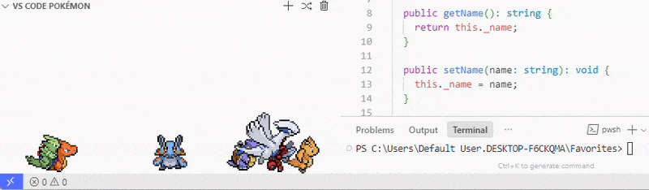
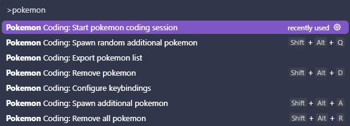
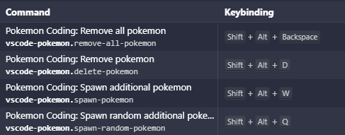
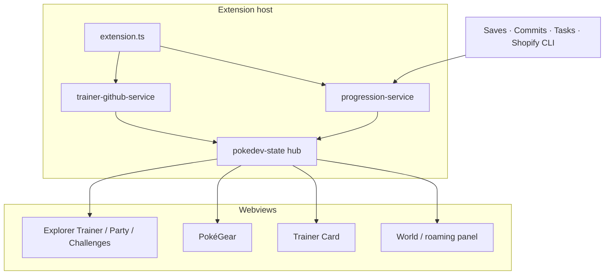

# PokéDev

> Nostalgic Pokémon sprites and a GitHub Trainer Card for your VS Code / Cursor window — partners that level up with the work you already do.

[](https://github.com/UribeJr/pokedev)
[](LICENSE)
[](https://code.visualstudio.com/)

<p align="center">
  <picture>
    <source media="(prefers-color-scheme: dark)" srcset="pokedev.gif">
    <source media="(prefers-color-scheme: light)" srcset="pokedev-light.gif">
    
  </picture>
</p>

## Overview

Coding sessions are long; most editor pets are just decoration. **PokéDev** turns your VS Code or Cursor sidebar into a living Pokémon world: pick a partner, watch it roam a 2D overworld (or classic floor pets), and earn real Trainer + Partner XP from saves, commits, coding time, and successful builds/tests — including Shopify theme/app outcomes when that is your workspace.

Built and maintained by [UribeJr](https://github.com/UribeJr) as a personal, actively developed fan project. Free, local-first, and privacy-conscious: public GitHub / DEV Community reads only — no OAuth, no telemetry.

## Highlights

- **Progression tied to real work** — batched saves, coding time, Git commits, and verified task exits (not terminal scraping) feed Trainer XP, Partner XP, Friendship, and Daily Challenges
- **GitHub Trainer Card** — retro card that pairs public GitHub identity with live in-editor progression; PokéDev or Pokémon Crystal (Day/Night) skins
- **PokéGear + Explorer surfaces** — Status / Activity / Badges / Party / Bag in one panel, plus compact Trainer, Party, and Daily Challenges views in Explorer
- **Gen 1–4 evolution depth** — level-up, Friendship, and Evolution Stones (Fire / Water / Thunder / Leaf / Moon / Sun) with nickname, shiny, XP, and Friendship preserved
- **Shopify-aware Dev Actions** — theme check / push and app build / deploy earn XP only on verified success; Shopify-specific Daily Challenges appear in matching workspaces
- **Agent-aware idle clock** — `auto` / `manual` / `agentic` modes so Coding Time stays honest whether you type or supervise an agent

## Features

### World & party
- Overworld or classic roaming; Johto Route / Ilex Forest / Cave environments; optional GBC display borders
- Spawn, nickname, shiny odds, import/export party; Pokémon names in EN / FR / DE / JA
- In-world reactions and toasts for meaningful saves, commits, failed tasks, and level-ups
- Cosmetic Poké Ball sprites (38 options) that persist through evolution

### Trainer systems
- Trainer Card with DEV RECORD (repos, stars, followers, specialties) and TRAINER RECORD (partner, badges, coding time)
- PokéGear five-tab hub (always Crystal-skinned)
- Daily Challenges regenerated per calendar day from real progression events
- DEV Community badge grid (username only; cached public data)

### Progression & evolution
- Dual XP tracks (Trainer + Partner) with throttles and batching designed for human *and* agent-driven edits
- Evolution Stones in Bag; stone grants at Trainer Lv. 5 / 10 / 15 / 20 / 25 / 30
- Optional Exp. Share for non-partner party members
- Deep reference: [docs/PROGRESSION.md](docs/PROGRESSION.md) · [docs/EVOLUTION_STONES.md](docs/EVOLUTION_STONES.md)

## Quick Start

**Prerequisites:** Node.js + npm, [VS Code](https://code.visualstudio.com/) or [Cursor](https://cursor.com/) `^1.73.0`.

PokéDev is **not** on the VS Marketplace yet. Install from a packaged `.vsix` (when you publish one to [Releases](https://github.com/UribeJr/pokedev/releases)) or build locally:

### Build & run (Extension Development Host)

```bash
git clone https://github.com/UribeJr/pokedev.git
cd pokedev
npm install
npm run compile
```

Then press **F5** in VS Code/Cursor to launch an Extension Development Host, or package a VSIX:

```bash
npx @vscode/vsce package
# → pokedev-6.2.0.vsix
code --install-extension pokedev-6.2.0.vsix    # or: cursor --install-extension …
```

### First session

1. Command Palette → **`PokéDev: Start pokemon coding session`**
2. Optionally **`PokéDev: Open Trainer Card`** and connect a GitHub username
3. **`PokéDev: Open PokéGear`** for Status / Activity / Party / Bag
4. Search settings for `pokedev` to tune size, position, roaming, progression mode, and more



| Keybinding | Command |
| --- | --- |
| `Alt+Shift+W` | Spawn additional Pokémon |
| `Alt+Shift+Q` | Spawn random Pokémon |
| `Alt+Shift+D` | Remove Pokémon |
| `Alt+Shift+Backspace` | Remove all Pokémon |

Customize via **`PokéDev: Configure keybindings`**.



## Stack

| Layer | Choice |
| --- | --- |
| Language | **TypeScript** |
| Host | VS Code Extension API (`engines.vscode` `^1.73.0`) + web extension build |
| UI | Webviews (world panel, Trainer Card, PokéGear, Explorer views) + webpack bundles |
| Build | `tsc` (extension / tests) + **webpack** (panel + web) |
| Quality | ESLint, Prettier, Husky, Mocha unit suites, GitHub Actions CI |
| Data | Local extension storage (collection, progression, inventory); public GitHub + DEV HTTP only |
| i18n | `@vscode/l10n` + Pokémon name locales |

Publisher id in manifest: `uribejr` · package version **6.2.0**.

## Architecture

Extension host services own progression, GitHub/DEV fetches, inventory, and Shopify task bridges. Webviews render the world, Trainer Card, PokéGear, and Explorer chrome. A shared `pokedevState` hub broadcasts collection / partner / progression / profile updates so surfaces stay in sync without tight coupling.



```
src/
├── extension/     Activation, services, panels, Explorer views, Shopify bridge
├── panel/         World rendering, roaming, reactions, Trainer Card / PokéGear UI
├── progression/   XP ledger, evolution, Friendship, Dev / Shopify action rules
├── trainer/       GitHub + DEV parsing, trainer class, profile types
├── challenges/    Daily challenge catalog, RNG, progress
├── pokegear/      Activity feed helpers / types
├── common/        Pokémon data, environments, skins, storage keys
└── test/          Integration + unit suites
```

## Configuration (high-signal)

| Setting | Default | Purpose |
| --- | --- | --- |
| `pokedev.position` | `explorer` | World webview in Explorer vs panel |
| `pokedev.roamingStyle` | `overworld` | Full 2D roam vs classic floor pets |
| `pokedev.environment` / `displaySkin` | `none` | Background scene / GBC bezel |
| `pokedev.githubUsername` | `""` | Public GitHub identity on Trainer Card |
| `pokedev.trainerCard.style` | `pokedev` | `pokedev` or `crystal` |
| `pokedev.crystalPalette` | `auto` | Day / Night / follow IDE theme |
| `pokedev.progression.mode` | `auto` | Coding-time idle clock: auto / manual / agentic |
| `pokedev.devActions.enabled` | `true` | XP from successful build/test/lint/typecheck tasks |
| `pokedev.shopifyDevActions.enabled` | `true` | XP from verified Shopify CLI outcomes |

Full property list lives in `package.json` `contributes.configuration`.

## Privacy

- No authentication, OAuth, or tokens — only public GitHub and DEV Community data
- Usernames are settings; cached profiles stay in local extension storage and are **not** Settings-Synced
- Webviews have no network access; the extension host makes external requests
- No telemetry; Dev / Shopify detection uses task exit codes and declared metadata, never terminal scrape or shop credentials

## Project status

**Active** (v6.2.0). Recent work: Shopify Dev Actions, Evolution Stones / Bag, Crystal Day/Night palette, Poké Ball cosmetics, Explorer sidebar views, and in-world reactions.

Honest gaps to know about:

- Not published to VS Marketplace / Open VSX yet — install via VSIX or F5
- GitHub [Releases](https://github.com/UribeJr/pokedev/releases) may not yet include a packaged `.vsix` — prefer building from `main` until a release is cut
- Pokédex / Shinies counters on the Trainer Card are not fully wired (stay at zero)
- Several feature screenshots under `docs/screenshots/` are still placeholders; root demo GIFs (`pokedev.gif`, `pokedev-light.gif`) and `usage.png` / `keybindings.png` are live

## Credits & legal

Fan project — **not affiliated with, endorsed by, or sponsored by** Nintendo, The Pokémon Company, Game Freak, Shopify, or DEV Community.

Pokémon names, sprites, and game-derived pixel art remain © their respective owners and are **not** covered by the MIT grant. See the [LICENSE](LICENSE) third-party notice and the detailed asset attributions in the repository Credits (sprite packs, trainer portraits, GBC overlays, Poké Ball icons, Crystal tiles, Silkscreen font).

## License

[MIT](LICENSE) for code. Game content carve-out as noted above.
